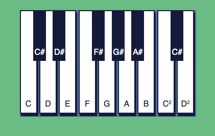
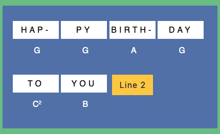

# Piano Player JS Project

This is a modified and improved version of the CodeCademy project "Piano Keys"
This version actually produces sound when the keys are pressed and the correct keys were added to the keyboard to come up with a birthday song that is as close to the original as possible.

## Usage

1. The visual piano allows you to play all 16 keys and practice songs (if you know any). But, we provide below the keys to play a *happy birthday* song.

2. Once you get good at the first part of the song, you can move to the next part by clicking "Line 2" then "Line 3" and so on. 

3. You can continue practicing or playing the song without the help from the guide below. 

> I hope you enjoy! If you have Codecademy questions please send them to thealexlock@gmail.com :)